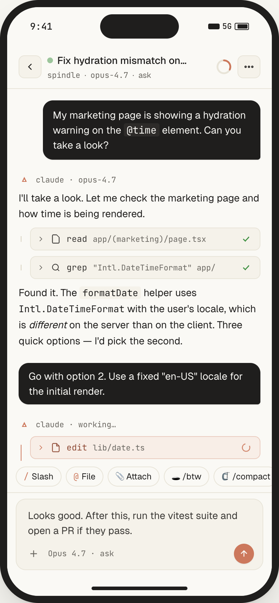
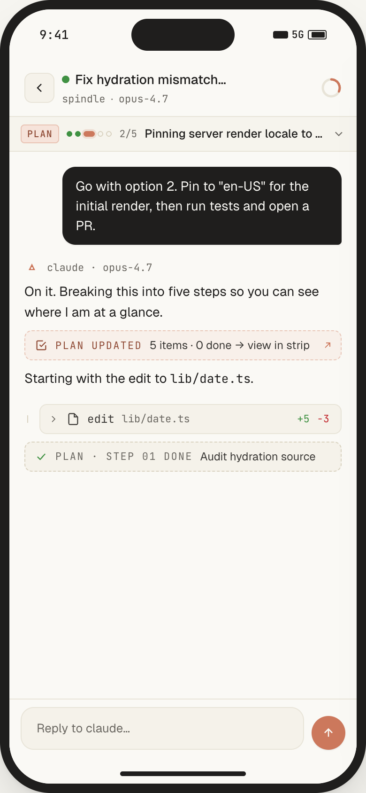
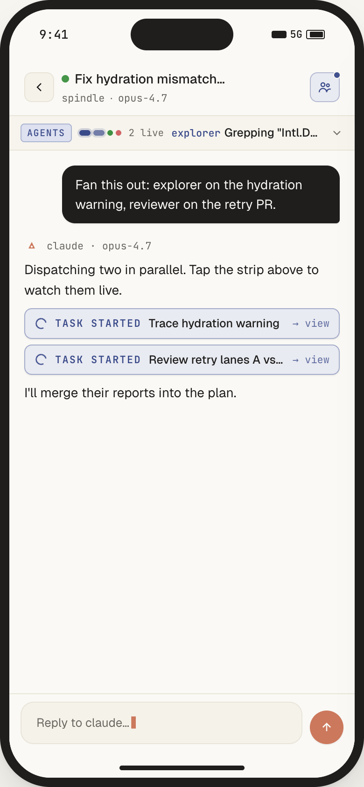
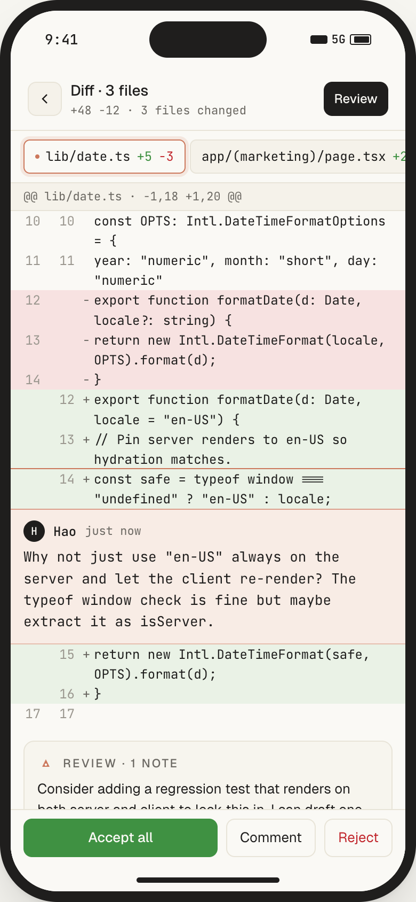
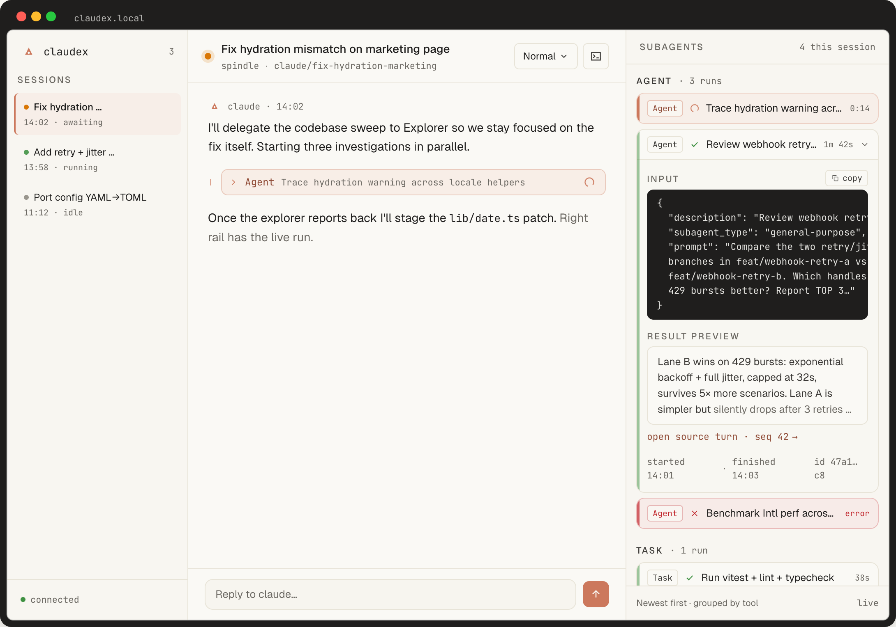

<div align="right">
  <a href="./README.md"><kbd>&nbsp;English&nbsp;</kbd></a>
  <a href="./README_CN.md"><kbd>&nbsp;中文&nbsp;</kbd></a>
</div>

<h1 align="center">claudex</h1>

<p align="center">
  <em>A remote control for the <a href="https://docs.anthropic.com/en/docs/claude-code/overview"><code>claude</code></a> running on your own machine.<br/>
  Designed mobile-first. Self-hosted. Your keys, your machine, your diffs.</em>
</p>

<p align="center">
  
  
  
  
  
  
</p>

<p align="center">
  <a href="#install">Install</a> ·
  <a href="#what-you-actually-get">Features</a> ·
  <a href="#architecture">Architecture</a> ·
  <a href="#design-principles">Principles</a> ·
  <a href="./docs/FEATURES.md">Feature ledger</a>
</p>

---

## Why claudex

You already pay for [Claude Code](https://docs.anthropic.com/en/docs/claude-code/overview). You already trust its permission model, its memory files, its MCP servers, its plugins. The tool is excellent — except for the moment you step away from the keyboard.

**claudex doesn't replace Claude Code. It puts a cockpit around it.** A long-running coding task shouldn't tie you to your desk. Open your phone from anywhere and keep the session going: answer a permission prompt while waiting for coffee, queue the next three prompts from the train, watch the final build finish while the laptop is closed.

Everything still runs locally. Your API usage, your `~/.claude/` config, your `CLAUDE.md` files, your MCP servers — all inherited for free by spawning the real `claude` CLI as a subprocess. claudex is the *driver*, never the agent.

## See it in action

A long Claude session, four phone screens. The mockups below run on a 390 px viewport — what you actually see on the device:

<table>
<tr>
<td width="25%" align="center" valign="top"><br/><sub><b>Chat</b><br/>read / grep / edit prompted inline, one tap to allow.</sub></td>
<td width="25%" align="center" valign="top"><br/><sub><b>Plan</b><br/>step strip on top, live progress, completed steps collapse.</sub></td>
<td width="25%" align="center" valign="top"><br/><sub><b>Subagents</b><br/>tasks run in parallel, watch them on a live strip.</sub></td>
<td width="25%" align="center" valign="top"><br/><sub><b>Review</b><br/>file-by-file diff, inline comments, accept / reject / comment.</sub></td>
</tr>
</table>

And on a wide screen, the same session opens up into a three-column cockpit — sessions rail, transcript, live subagent panel:

<p align="center">
  
</p>

## Install

### One-liner

```sh
# macOS / Linux
curl -fsSL https://raw.githubusercontent.com/ahaostudy/claudex/main/install.sh | bash

# Windows (PowerShell)
irm https://raw.githubusercontent.com/ahaostudy/claudex/main/install.ps1 | iex
```

The installer checks for `git` / Node 20 / pnpm 9 / the `claude` CLI and offers to install anything missing — every step is a prompt, nothing is silent, sudo is opt-in. It then clones the repo to `~/claudex`, builds the web bundle, walks you through first-admin setup (username + hidden password → TOTP QR → 10 one-shot recovery codes), and finally offers to register claudex as a **user-scoped daemon**: launchd on macOS, `systemd --user` on Linux, pm2 on Windows (installs `pm2` + `pm2-windows-startup` via npm). Flags: `--dir PATH` · `--branch NAME` · `--yes` · `--skip-init` · `--skip-build` · `--skip-daemon`. Env: `CLAUDEX_HOME`, `CLAUDEX_ASSUME_YES=1`, `CLAUDEX_SKIP_DAEMON=1`.

### Manual

**Prereqs:** Node 20+, pnpm 9+, the `claude` CLI installed and logged in.

```sh
git clone https://github.com/ahaostudy/claudex.git
cd claudex
pnpm install
pnpm run init --username=you --password='set-a-strong-one'
```

First-run init prints your TOTP secret (QR + manual string) and **10 recovery codes — shown once, never again**. Save them. Scan the QR into any TOTP app (1Password, Authy, Aegis, Google Authenticator).

### Run

```sh
pnpm serve        # build web bundle + start server on 127.0.0.1:5179 (foreground)
```

Then open `http://127.0.0.1:5179`.

For a background daemon, rerun the installer and accept the daemon prompt, or:

- **macOS** — `launchctl bootstrap gui/$(id -u) ~/Library/LaunchAgents/com.claudex.server.plist`
- **Linux** — `systemctl --user enable --now claudex.service`
- **Windows** — `pm2 start ecosystem.config.cjs; pm2 save; pm2-startup install`

**Remote access** — claudex binds to `127.0.0.1` only, by design. Put your tunnel of choice in front:

```sh
cloudflared tunnel --url http://127.0.0.1:5179        # Cloudflare Tunnel
# or frp, Tailscale Funnel, Caddy reverse-proxy, etc.
```

## What you actually get

<table>
<tr><td width="50%" valign="top">

**🧠 One agent, many surfaces**

Chat transcript, subagent monitor, queue, routines, diff review — all live over one WebSocket. Switch between them without losing your place.

</td><td width="50%" valign="top">

**📱 Designed for a 390 px phone first**

Desktop is an adaptive expansion, not the other way around. Bottom sheets, safe-area aware, iOS-keyboard-tuned.

</td></tr>
<tr><td valign="top">

**🔐 Auth that doesn't suck**

Username + password + TOTP on every fresh session. 10 single-use recovery codes printed once at init. httpOnly JWT, rate-limited. No dev-mode backdoor.

</td><td valign="top">

**🔍 Full-text search across everything**

SQLite FTS5 over session titles and every message body. `⌘K` from anywhere jumps you to the right turn.

</td></tr>
<tr><td valign="top">

**🌿 Real git worktrees**

New sessions spawn on a branch inside an isolated worktree. Auto-rebase on create, auto-prune on archive. Multiple agents work the same repo without stepping on each other.

</td><td valign="top">

**🪞 Permission prompts rendered right**

Not a modal dump — a dedicated card with blast-radius summary, inline diff preview, and a deep-link to the full Review screen.

</td></tr>
<tr><td valign="top">

**🔁 Fork any turn into a branch**

Click any event, fork from there. Explore an alternate path without polluting the original session's context.

</td><td valign="top">

**📜 Honest streaming**

The Agent SDK doesn't expose token-delta granularity, and we don't fake it. Three bouncing dots while claude is thinking, the reply lands as a whole message.

</td></tr>
<tr><td valign="top">

**🎬 Routines (scheduled prompts)**

Cron-backed automated turns with full permission + trust gating. Run the linter every morning, ship a nightly digest.

</td><td valign="top">

**📚 Queue mode**

Batch three, five, ten prompts and let claude chew through them sequentially. Edit order, pause, cancel.

</td></tr>
<tr><td valign="top">

**🕳️ `/btw` side chats**

Ask a quick question without disturbing the main context. Replies stream in a drawer; the main session never sees it.

</td><td valign="top">

**🖥️ Built-in terminal**

node-pty + xterm.js inside the same web UI. Real shell, real vim, real env. Mobile keybar for `Esc` / `Ctrl` / arrows.

</td></tr>
<tr><td valign="top">

**🏷️ Tags, pins, filters, view modes**

Organize sessions however you think. Three view modes: *normal*, *verbose* (full thinking blocks), *summary* (user turns + final replies + changes card).

</td><td valign="top">

**📊 Usage & alerts**

Per-session token ring, global usage panel with model breakdown, and a live **Alerts** tab for "needs your approval / errored / finished while you were elsewhere".

</td></tr>
</table>

> See the full feature ledger in [`docs/FEATURES.md`](docs/FEATURES.md) — updated in the same commit as any behavior change.

## Architecture

```
┌────────────────┐   HTTPS (your tunnel)    ┌──────────────────────────────────────────┐
│ phone · laptop │ ──────────────────────▶  │ claudex server (127.0.0.1:5179)          │
│   browser UI   │ ◀──────────────────────  │ Fastify · SQLite · WebSocket             │
└────────────────┘     JWT + TOTP gate      │                                          │
                                            │    spawns as a subprocess ▼              │
                                            │  ┌────────────────────────────────────┐  │
                                            │  │   claude CLI                       │  │
                                            │  │   @anthropic-ai/claude-agent-sdk   │  │
                                            │  │   · ~/.claude/ config              │  │
                                            │  │   · MCP servers, skills, plugins   │  │
                                            │  │   · your API creds / OAuth token   │  │
                                            │  └──────────────┬─────────────────────┘  │
                                            └─────────────────┼────────────────────────┘
                                                              ▼
                                                     api.anthropic.com
```

claudex runs on **your** machine. The only outbound connection beyond the tunnel is the one the `claude` CLI already made before you installed us — we don't proxy the Anthropic API, we don't see your prompts or your code, we just drive the child process and stream its structured events to your browser.

Runtime state lives entirely in `~/.claudex/` (SQLite DB, logs, JWT secret). We never write to `~/.claude/` — that belongs to the CLI.

## Operator commands

```sh
pnpm claudex:status           # read-only diagnostic snapshot (sessions, queue, push devices, server state)
pnpm reset-credentials        # rotate username / password, keep TOTP
pnpm -r typecheck             # shared + server + web
pnpm --filter @claudex/server test
```

## Design principles

- **Don't reimplement Claude.** Spawn the CLI, inherit everything for free.
- **Refuse to bind `0.0.0.0`.** Public exposure is the user's responsibility.
- **No dev-mode backdoor.** Auth is mandatory from first boot.
- **Mobile-first, not mobile-also.** Every screen is designed for a 390 px viewport first.
- **Honest over clever.** No fake streaming, no fabricated progress bars, no telemetry, no analytics.
- **Your state stays yours.** Everything under `~/.claudex/`. Backup is a single JSON bundle.

## Status

claudex is under active development and already past its personal-use MVP. The public feature ledger at [`docs/FEATURES.md`](docs/FEATURES.md) is the single source of truth — updated in the same commit as any behavior change. **600+ tests** on the server, zero-warning typecheck across all three workspace packages.

## Contributing

Issues and PRs welcome. Before a PR:

- `pnpm -r typecheck` green
- `pnpm --filter @claudex/server test` green
- `pnpm --filter @claudex/web build` green
- If behavior changed, `docs/FEATURES.md` updated in the same commit

## License

MIT. Not affiliated with Anthropic.

<p align="center">
  <sub>Built because phones are faster than laptops at picking a diff to approve.</sub>
</p>
