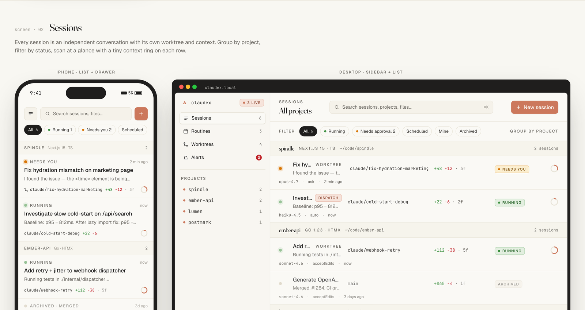

<div align="right">
  <a href="./README.md"><kbd>&nbsp;English&nbsp;</kbd></a>
  <a href="./README_CN.md"><kbd>&nbsp;中文&nbsp;</kbd></a>
</div>

<p align="center">
  
</p>

<h1 align="center">claudex</h1>

<p align="center">
  <em>你本机 <a href="https://docs.anthropic.com/zh-CN/docs/claude-code/overview"><code>claude</code></a> 的远程遥控器。<br/>
  移动优先，自托管，密钥在你机器上，diff 在你眼前。</em>
</p>

<p align="center">
  
  
  
  
  
  
</p>

<p align="center">
  <a href="#安装">安装</a> ·
  <a href="#你能拿到什么">功能</a> ·
  <a href="#架构">架构</a> ·
  <a href="#设计原则">原则</a> ·
  <a href="./docs/FEATURES.md">特性清单</a>
</p>

---

## 为什么做 claudex

你已经在用 [Claude Code](https://docs.anthropic.com/zh-CN/docs/claude-code/overview)。你信它的权限模型、记忆文件、MCP 服务、插件体系。工具本身足够好——除了你离开键盘的那一刻。

**claudex 不是 Claude Code 的替代品，而是它的驾驶舱。** 一个长耗时的编码任务不该把你钉在桌前。打开手机，从任何地方接管进行中的会话：在等咖啡的时候批准一个权限请求、在地铁里排队下三个 prompt、合上笔电后从床上看最终构建跑完。

一切仍然跑在本地。你的 API 配额、`~/.claude/` 配置、`CLAUDE.md` 文件、MCP 服务器——全部通过把真正的 `claude` CLI 作为子进程拉起而免费继承。claudex 只是**驱动器**，永远不是 agent 本身。

## 安装

### 一行命令

```sh
# macOS / Linux
curl -fsSL https://raw.githubusercontent.com/ahaostudy/claudex/main/install.sh | bash

# Windows (PowerShell)
irm https://raw.githubusercontent.com/ahaostudy/claudex/main/install.ps1 | iex
```

安装脚本会检查 `git` / Node 20 / pnpm 9 / `claude` CLI，缺什么都先问你同意再装——没有静默动作、不会擅自 sudo。然后克隆仓库到 `~/claudex`，构建 Web bundle，再引导你完成首次管理员初始化（用户名 + 隐藏输入的密码 → TOTP 二维码 → 10 条**仅显示一次**的恢复码）。参数：`--dir PATH` · `--branch NAME` · `--yes` · `--skip-init` · `--skip-build`。环境变量：`CLAUDEX_HOME`、`CLAUDEX_ASSUME_YES=1`。

### 手动

**前置：** Node 20+、pnpm 9+、`claude` CLI 已安装并登录。

```sh
git clone https://github.com/ahaostudy/claudex.git
cd claudex
pnpm install
pnpm init --username=you --password='set-a-strong-one'
```

首次 init 会打印你的 TOTP 密钥（二维码 + 手输字符串）和 **10 条恢复码——只显示一次，过后再也看不到**。请务必保存。把二维码扫进任意 TOTP 应用（1Password / Authy / Aegis / Google Authenticator 均可）。

### 运行

```sh
pnpm serve        # 构建 Web bundle + 启动服务，监听 127.0.0.1:5179
```

然后打开 `http://127.0.0.1:5179`。

**远程访问** —— claudex 刻意只绑 `127.0.0.1`。请在前面套自己的隧道：

```sh
cloudflared tunnel --url http://127.0.0.1:5179        # Cloudflare Tunnel
# 或 frp、Tailscale Funnel、Caddy 反代等等
```

## 你能拿到什么

<table>
<tr><td width="50%" valign="top">

**🧠 一个 agent，多种切面**

聊天、子 agent 监视、prompt 队列、定时 routines、diff 审阅——统一走一条 WebSocket。切换视图不丢上下文。

</td><td width="50%" valign="top">

**📱 390 px 手机优先**

桌面是手机的自适应扩展，而不是反过来。底部 sheet、安全区适配、针对 iOS 软键盘做过调校。

</td></tr>
<tr><td valign="top">

**🔐 不糊弄的鉴权**

每次新会话：用户名 + 密码 + TOTP。10 条一次性恢复码首次 init 时打印一次。httpOnly JWT、登录限流、无 dev 后门。

</td><td valign="top">

**🔍 全文搜索覆盖到每条消息**

SQLite FTS5 索引会话标题和所有消息正文。在任何位置按 `⌘K`，直接跳到对应 turn。

</td></tr>
<tr><td valign="top">

**🌿 真·git worktree**

新会话自动开 branch + 独立 worktree，创建时自动 rebase、归档时自动 prune。多个 agent 并行不互相踩脚。

</td><td valign="top">

**🪞 权限请求被认真渲染**

不是甩个 modal——独立卡片带"影响面"摘要、内联 diff 预览、以及跳到完整 Review 页的 deep-link。

</td></tr>
<tr><td valign="top">

**🔁 任意 turn 都能 fork**

点任意事件，从那一刻 fork 出去。探索另一条路径，不污染原会话上下文。

</td><td valign="top">

**📜 诚实的流式**

Agent SDK 没开放 token-delta 粒度，我们也不假装有。claude 思考时是三个跳动的点，回复整段落地。

</td></tr>
<tr><td valign="top">

**🎬 Routines（定时 prompt）**

Cron 驱动的自动 turn，带完整权限 + 信任门。每天早上跑 lint，每晚出一份 digest。

</td><td valign="top">

**📚 队列模式**

三条、五条、十条 prompt 一起塞进来，让 claude 顺序消化。可调顺序、可暂停、可取消。

</td></tr>
<tr><td valign="top">

**🕳️ `/btw` 副本会话**

临时问一句，不打扰主上下文。回复流到抽屉里，主会话完全看不到。

</td><td valign="top">

**🖥️ 内置终端**

node-pty + xterm.js，同一个 Web UI 里跑真实 shell、真实 vim、真实环境变量。手机下有 `Esc` / `Ctrl` / 方向键键条。

</td></tr>
<tr><td valign="top">

**🏷️ 标签、置顶、筛选、视图模式**

按你自己的心智模型整理会话。三种视图：*normal*、*verbose*（含完整 thinking 块）、*summary*（只看用户 turn + 最终回复 + 改动卡片）。

</td><td valign="top">

**📊 Usage 与 Alerts**

每个会话有一圈 token 环，全局 usage 面板按模型拆分；**Alerts** 实时标注"等你批准 / 出错了 / 你不在时完成了"。

</td></tr>
</table>

> 完整特性清单见 [`docs/FEATURES.md`](docs/FEATURES.md) —— 任何行为变更都在同一个 commit 里同步这份文件。

## 架构

```
┌────────────────┐   HTTPS（你的隧道）       ┌──────────────────────────────────────────┐
│ 手机 · 笔电     │ ──────────────────────▶  │ claudex server (127.0.0.1:5179)          │
│   浏览器 UI     │ ◀──────────────────────  │ Fastify · SQLite · WebSocket             │
└────────────────┘    JWT + TOTP 鉴权        │                                          │
                                             │        以子进程形式拉起 ▼                │
                                             │  ┌────────────────────────────────────┐  │
                                             │  │   claude CLI                       │  │
                                             │  │   @anthropic-ai/claude-agent-sdk   │  │
                                             │  │   · ~/.claude/ 配置                │  │
                                             │  │   · MCP 服务、skills、插件         │  │
                                             │  │   · 你的 API 凭据 / OAuth token    │  │
                                             │  └──────────────┬─────────────────────┘  │
                                             └─────────────────┼────────────────────────┘
                                                               ▼
                                                      api.anthropic.com
```

claudex 跑在**你自己**的机器上。除了你设的隧道之外，唯一对外的连接是那个 `claude` CLI 在你装 claudex 之前就已经在发的——我们不代理 Anthropic API、看不到你的 prompt、看不到你的代码，只是驱动那个子进程并把它的结构化事件流给你的浏览器。

运行时状态全部落在 `~/.claudex/`（SQLite、日志、JWT 密钥）。`~/.claude/` 是 CLI 的领地，我们一字不写。

## 运维命令

```sh
pnpm claudex:status           # 只读快照（会话数、队列、推送设备、服务状态）
pnpm reset-credentials        # 轮换用户名 / 密码，保留 TOTP
pnpm -r typecheck             # shared + server + web
pnpm --filter @claudex/server test
```

## 设计原则

- **不重新实现 Claude。** 把 CLI 拉起来做子进程，所有配置免费继承。
- **拒绝绑 `0.0.0.0`。** 公网暴露是用户自己的事。
- **没有 dev 后门。** 首次启动就必须鉴权，永远不松。
- **移动优先，不是"也兼容移动"。** 每一屏先在 390 px 手机上画过，再扩展到桌面。
- **诚实胜过花哨。** 不伪造流式、不伪造进度条、不做 telemetry、不做 analytics。
- **你的数据归你。** 一切落在 `~/.claudex/`，备份就是一个 JSON bundle。

## 状态

claudex 仍在积极开发，已经越过个人自用 MVP。公开的特性清单 [`docs/FEATURES.md`](docs/FEATURES.md) 是唯一 source of truth——任何行为变更在同一个 commit 里同步更新。服务端 **600+ 测试**，三个包 typecheck 零 warning。

## 参与贡献

欢迎 Issue 和 PR。提 PR 前先过一遍：

- `pnpm -r typecheck` 绿
- `pnpm --filter @claudex/server test` 绿
- `pnpm --filter @claudex/web build` 绿
- 如果改了行为，`docs/FEATURES.md` 在同一 commit 里同步

## License

MIT。本项目与 Anthropic 无任何关联。

<p align="center">
  <sub>做这个，是因为挑一个 diff 要不要批准，手机比笔电快。</sub>
</p>
